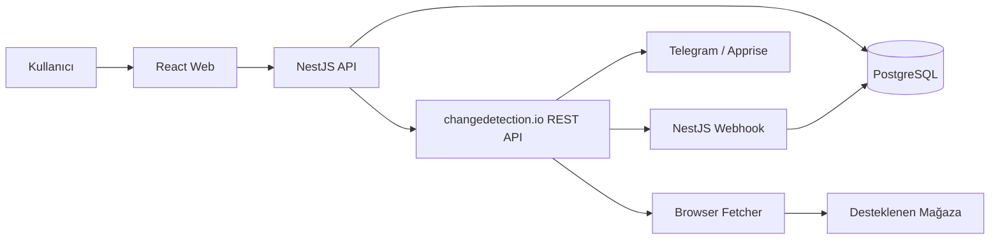

# Product Tracker

Product Tracker; e-ticaret ürünlerinin fiyat, stok ve beden/numara durumlarını takip eden, changedetection.io üzerine kurulu bir ürün takip uygulamasıdır.

## Ekip

| Kişi | Rol |
|---|---|
| Efe | Backend Lead, changedetection.io entegrasyonu, PostgreSQL, Docker |
| Haydar | Product Owner, Solution Architect, Frontend Developer, GitHub ve release yönetimi |

## MVP Teknoloji Yığını

- React
- Vite
- TypeScript
- TanStack Query
- React Hook Form
- Zod
- Recharts
- NestJS
- Prisma
- PostgreSQL
- changedetection.io
- Docker Compose
- Telegram / Apprise

> Redis ve BullMQ MVP kapsamında kullanılmayacaktır. Gerçek bir ihtiyaç ortaya çıkarsa sonraki sürümlerde değerlendirilecektir.

## Temel Mimari

## İlk Hedef

İlk çalışan sürüm tek mağaza ile geliştirilecektir. Zara ve SuperStep için teknik spike yapılacak, daha kolay ve güvenilir olan mağaza ilk hedef seçilecektir.

## Başlangıç Sırası

1. `PROJECT.md`
2. `docs/ARCHITECTURE.md`
3. `TEAM/EFE_TASKS.md`
4. `TEAM/HAYDAR_TASKS.md`
5. `SPRINT_BACKLOG.md`
6. `CODEX_START.md`

## Temel İlke

changedetection.io bir altyapı motorudur. Ürün domain modeli, kullanıcı deneyimi, fiyat/stok geçmişi ve uygulama sözleşmeleri bizim uygulamamızın sorumluluğundadır.
