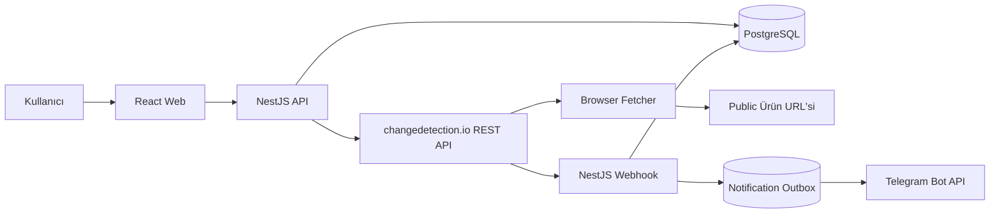

# Product Tracker

Product Tracker; herkese açık e-ticaret ürün URL'lerinin fiyat ve stok durumlarını günde bir kez takip eden, changedetection.io üzerine kurulu ve Telegram ile bildirim gönderen bir ürün takip uygulamasıdır.

## Ekip

| Kişi   | Rol                                                                               |
| ------ | --------------------------------------------------------------------------------- |
| Efe    | Backend Lead, changedetection.io entegrasyonu, PostgreSQL, Docker                 |
| Haydar | Product Owner, Solution Architect, Frontend Developer, GitHub ve release yönetimi |

## MVP Teknoloji Yığını

- React
- Vite
- TypeScript
- TanStack Query
- React Hook Form
- Zod
- Recharts
- NestJS
- Prisma
- PostgreSQL
- changedetection.io
- Docker Compose
- Telegram Bot API / Apprise JSON webhook

> Redis ve BullMQ MVP kapsamında kullanılmayacaktır. Gerçek bir ihtiyaç ortaya çıkarsa sonraki sürümlerde değerlendirilecektir.

## Temel Mimari

## Site Desteği

Her public HTTP/HTTPS URL kabul edilir. Sistem önce genel changedetection.io price/restock profilini kullanır; ayrıştırılamayan bir domain için çekirdek sistemi değiştirmeden doğrulanmış bir site profili eklenir. Login, CAPTCHA veya güçlü anti-bot koruması bulunan sayfalarda başarı garantisi yoktur.

İlk açılışta takip edilecek URL'ler toplu olarak istenir. En az bir watch başarıyla oluşturulunca onboarding PostgreSQL'de tamamlanır ve sonraki başlangıçlarda tekrar gösterilmez. İlk baseline kontrolünden sonra her ürün 24 saatte bir kontrol edilir.

## Başlangıç Sırası

1. `CODEX_START.md`
2. `PROJECT.md`
3. `docs/ARCHITECTURE.md`
4. `docs/API.md`
5. `docs/DATABASE.md`
6. `docs/WEBHOOK_CONTRACT.md`
7. `docs/ADR/ADR-0004-generic-sites-onboarding-daily-telegram.md`
8. `docs/SITE_PROFILES.md`
9. `docs/TELEGRAM.md`
10. `TEAM/EFE_TASKS.md`
11. `TEAM/HAYDAR_TASKS.md`
12. `SPRINT_BACKLOG.md`

## Temel İlke

changedetection.io bir altyapı motorudur. Ürün domain modeli, kullanıcı deneyimi, fiyat/stok geçmişi ve uygulama sözleşmeleri bizim uygulamamızın sorumluluğundadır.
