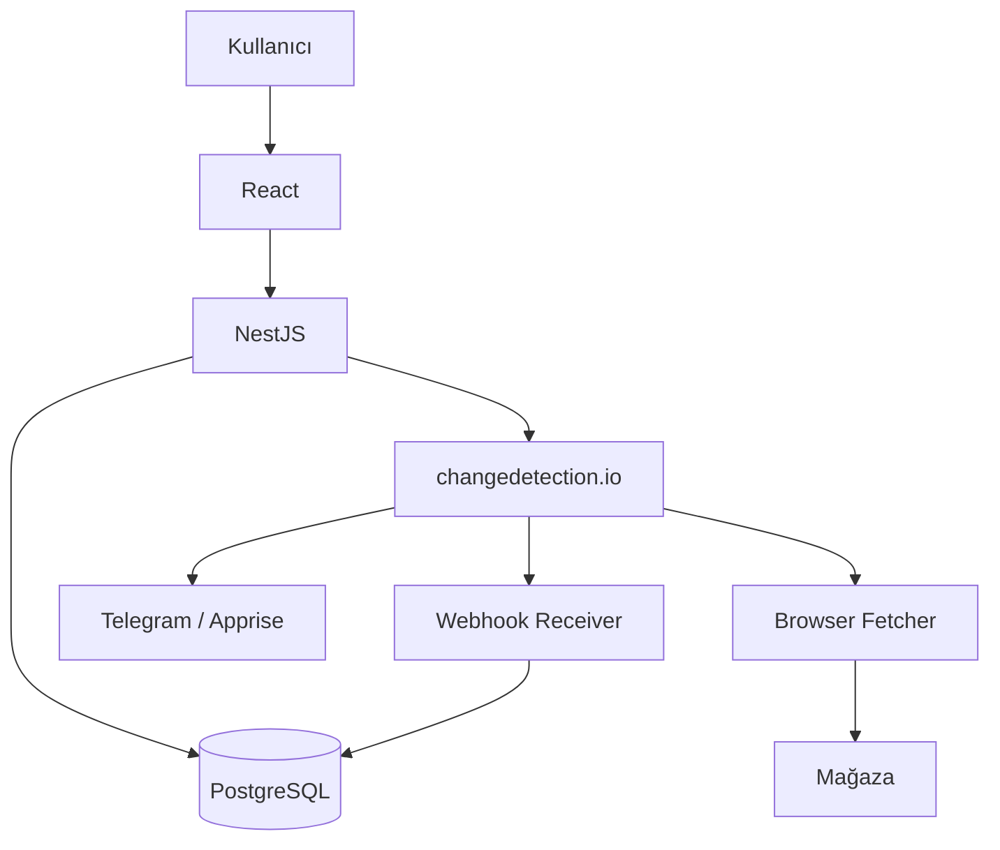
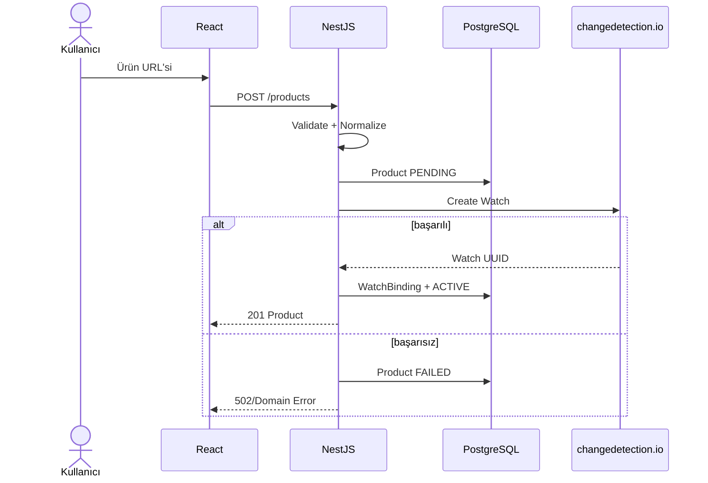
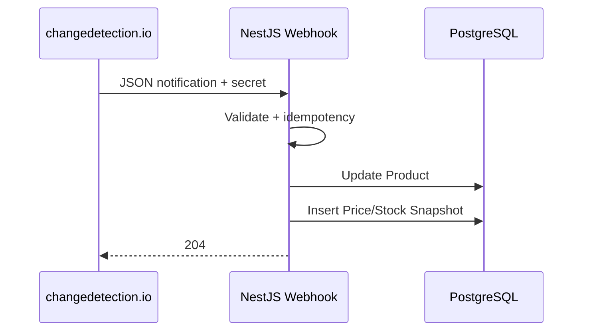

# Sistem Mimarisi

## 1. Sahiplik

| Alan | Sahip |
|---|---|
| Backend architecture | Efe |
| changedetection.io entegrasyonu | Efe |
| Database | Efe |
| Docker backend stack | Efe |
| Frontend | Haydar |
| Product scope | Haydar |
| GitHub ve release | Haydar |
| Mimari kararlar | Ortak |

## 2. Genel Diyagram

## 3. Neden NestJS?

changedetection.io teknik `watch UUID` modeliyle çalışır. Uygulamamız ise Product, Store, hedef fiyat ve snapshot modeliyle çalışır.

NestJS:

- domain dönüşümü
- güvenlik
- validation
- adapter
- persistence
- stable API contract

sağlar.

## 4. Neden PostgreSQL?

changedetection.io datastore'u uygulama dashboard'u ve sayısal zaman serisi için uygun domain veritabanı değildir.

PostgreSQL:

- ürünler
- tercihler
- temiz fiyat geçmişi
- temiz stok geçmişi
- watch eşleşmeleri
- hata/durum olayları

için kullanılır.

## 5. Neden Redis/BullMQ Yok?

MVP'de:

- schedule changedetection.io'da
- fetch worker changedetection.io'da
- retry changedetection.io'da
- event delivery webhook ile

olduğu için ayrı queue sistemi gereksizdir.

## 6. Product Create Sequence

## 7. Webhook Sequence

## 8. Reconciliation

Günlük cron:

1. Active WatchBinding kayıtlarını oku.
2. changedetection.io watch listesini al.
3. Eksik/fazla watch tespit et.
4. EventLog yaz.
5. Otomatik düzeltme yerine ilk sürümde raporla.

## 9. Bağımlılık Koruması

changedetection.io yalnız `ChangeDetectionClient` interface arkasında kullanılır. Başka bir motor gerekirse yeni adapter yazılabilir.

## 10. Version Strategy

- sabit Docker tag
- aylık changelog inceleme
- update öncesi test
- datastore backup
- gerekirse image mirror
