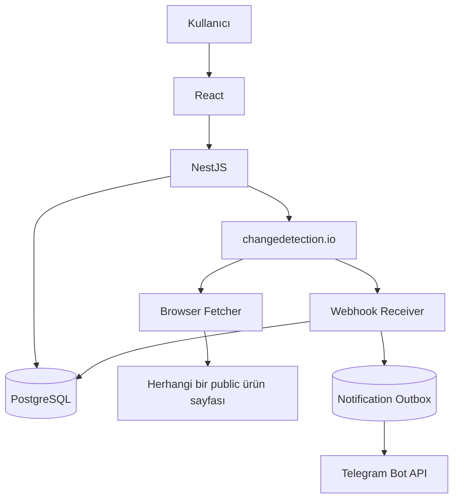
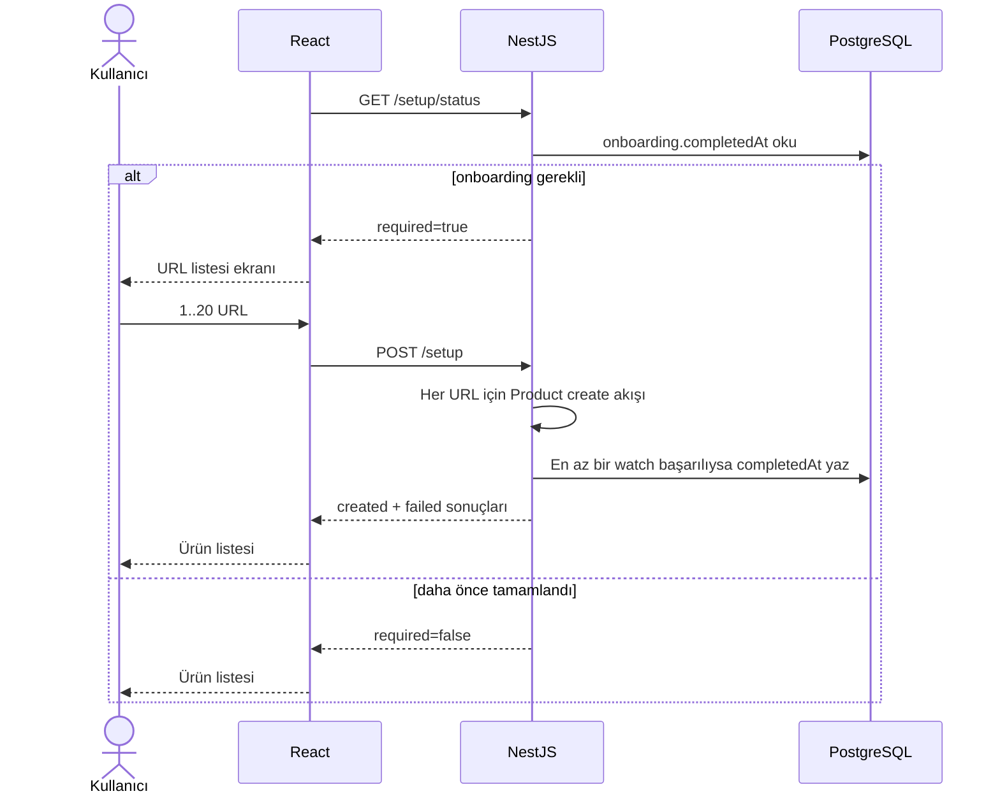
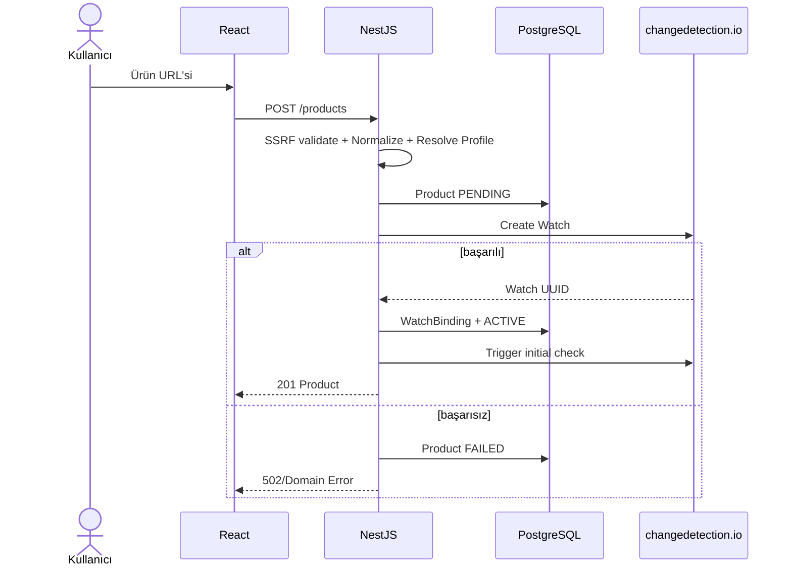
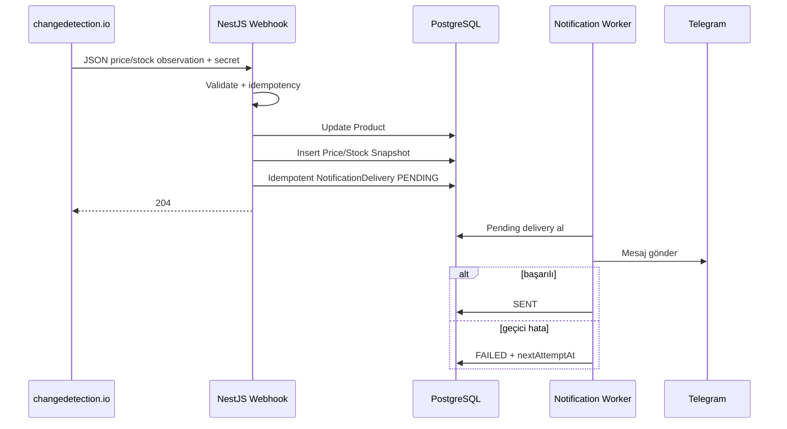

# Sistem Mimarisi

## 1. Sahiplik

| Alan                            | Sahip  |
| ------------------------------- | ------ |
| Backend architecture            | Efe    |
| changedetection.io entegrasyonu | Efe    |
| Database                        | Efe    |
| Docker backend stack            | Efe    |
| Frontend                        | Haydar |
| Product scope                   | Haydar |
| GitHub ve release               | Haydar |
| Mimari kararlar                 | Ortak  |

## 2. Genel Diyagram



## 3. Neden NestJS?

changedetection.io teknik `watch UUID` modeliyle çalışır. Uygulamamız ise Product, Store, hedef fiyat ve snapshot modeliyle çalışır.

NestJS:

- domain dönüşümü
- güvenlik
- validation
- adapter
- persistence
- stable API contract

sağlar.

## 4. Neden PostgreSQL?

changedetection.io datastore'u uygulama dashboard'u ve sayısal zaman serisi için uygun domain veritabanı değildir.

PostgreSQL:

- ürünler
- tercihler
- temiz fiyat geçmişi
- temiz stok geçmişi
- watch eşleşmeleri
- hata/durum olayları

için kullanılır.

## 5. Neden Redis/BullMQ Yok?

MVP'de:

- schedule changedetection.io'da
- fetch worker changedetection.io'da
- retry changedetection.io'da
- event delivery webhook ile

olduğu için ayrı queue sistemi gereksizdir.

## 6. Site Profile Çözümleme

Backend tek bir `SiteProfileRegistry` kullanır:

```text
URL
 ├── hostname'e özel doğrulanmış profil → site selector/fetch ayarları
 └── eşleşme yok → generic profile → changedetection price/restock processor
```

- Genel profil her public HTTP/HTTPS URL için adaydır.
- Profiller saf yapılandırma + contract test şeklinde tutulur.
- Siteye özel kod Product service, controller veya frontend'e eklenmez.
- Profil başarısızsa sistem CAPTCHA/anti-bot aşmaya çalışmaz; `EXTRACTION_UNSUPPORTED` kaydeder.
- Sabit domain allowlist'i yoktur. Güvenlik sınırı public network hedefi olup DNS ve redirect zincirinde yeniden doğrulanır.

## 7. İlk Açılış Sequence



Onboarding kararı frontend storage'a bağlı değildir. PostgreSQL volume korunduğu sürece uygulama ve container restart'larında tekrar gösterilmez.

## 8. Product Create Sequence



İlk kontrol başlangıç değerini üretir. Sonraki kontroller watch'ın kalıcı changedetection.io schedule'ı tarafından `86400` saniyede bir yapılır; API start hook'u kontrol tetiklemez.

## 9. Webhook ve Telegram Sequence



Notification worker aynı NestJS uygulamasındaki cron işidir; ayrı servis veya message broker değildir. Maksimum deneme sayısı ve artan gecikme uygulanır. Aynı `sourceEventKey + channel + notificationType` yalnız bir delivery üretir.

Pinned changedetection.io sürümü ilk snapshot için notification üretmediğinden ilk fiyat ayrı bir kalıcı baseline worker tarafından REST watch durumundan okunur. Worker yeni kontrol tetiklemez; yalnız ilk sonucu bekleyen binding'leri senkronize eder. Sonraki gerçek değişikliklerin kaynağı webhook'tur.

## 10. Reconciliation

Günlük cron (`@Cron`, varsayılan 03:00; `RECONCILIATION_ENABLED` ile kapatılabilir):

1. WatchBinding kayıtlarını oku.
2. changedetection.io watch listesini al.
3. Eksik/fazla watch tespit et.
4. EventLog yaz.
5. Otomatik düzeltme yerine ilk sürümde raporla.
6. Schedule'ın 24 saat olduğunu doğrula; sapmayı raporla.

Tüm satırlar `EventLog.type = RECONCILIATION` ile yazılır, `code` ayrımı yapar:

| code                   | Anlamı                                              |
| ---------------------- | --------------------------------------------------- |
| `WATCH_MISSING`        | Binding var, changedetection.io tarafında watch yok |
| `WATCH_ORPHANED`       | changedetection.io tarafında watch var, binding yok |
| `SCHEDULE_DRIFT`       | Watch beklenen aralıkta kontrol edilmemiş           |
| `WATCH_ERROR_REPORTED` | ACTIVE ürünün watch'ı hata bildiriyor               |
| `COMPLETED`            | Tur özeti (sayaçlar `metadata` içinde)              |

Sonuç ayrıca `AppSetting` içindeki `reconciliation.lastCompletedAt` anahtarına yazılır ve
`GET /system/health` üzerinden `lastReconciliation` olarak sunulur.

İki bilinçli sınır:

- `WatchSummary` bir kontrol aralığı alanı taşımaz. Bu yüzden schedule sapması aralık
  karşılaştırmasıyla değil, `lastCheckedAt` boşluğundan çıkarılır: eşik
  `CHECK_INTERVAL_SECONDS × RECONCILIATION_STALE_MULTIPLIER` (varsayılan 30 saat).
- changedetection.io örneği yalnız bu uygulamaya aittir (ADR-0001). Kullanıcı arayüzden
  elle watch eklerse `WATCH_ORPHANED` olarak raporlanır; bu bir yanlış pozitif değil,
  bilinçli olarak görünür kılınan bir durumdur.

## 10.1 Loglama ve Request ID

`RequestIdMiddleware` her HTTP isteği için `AsyncLocalStorage` tabanlı bir bağlam kurar.
Bağlam DI gerektirmediği için `main.ts` içinde `new` ile kurulan `DomainExceptionFilter`
tarafından da okunabilir. Ek bir log kütüphanesi kullanılmaz; tüm satırlar `logJson` ile
`{ "event": ..., "requestId": ..., ... }` biçiminde yazılır.

Arka plan işleri HTTP bağlamı taşımaz. `BaselineSyncService`, `NotificationWorkerService`
ve `ReconciliationService` her turu kendi `requestId`'si ve `source` etiketiyle sarar,
böylece bir turun tüm satırları ilişkilendirilebilir.

Secret'lar loglanmaz. Interceptor yalnız beyaz listelenmiş alanları yazar: `method`,
eşleşen rota kalıbı, `status`, `durationMs`. Ham URL, başlıklar ve gövdeler hiçbir zaman
loglanmaz — özellikle `x-webhook-secret`, `CHANGEDETECTION_API_KEY`, `TELEGRAM_BOT_TOKEN`
ve secret'ı query parametresinde taşıyan Apprise notification URL'i.

## 11. Bağımlılık Koruması

changedetection.io yalnız `ChangeDetectionClient` interface arkasında kullanılır. Başka bir motor gerekirse yeni adapter yazılabilir.

## 12. Restart ve Kalıcılık

| Veri                                    | Kaynak                           | Restart davranışı         |
| --------------------------------------- | -------------------------------- | ------------------------- |
| Product, setup durumu, snapshot, outbox | PostgreSQL volume                | Korunur                   |
| Watch ve 24 saat schedule               | changedetection datastore volume | Korunur                   |
| Telegram secret'ları                    | Environment/secret               | Yeniden yüklenir          |
| UI setup kararı                         | API `setup/status`               | Local storage kullanılmaz |

## 13. Version Strategy

- sabit Docker tag
- aylık changelog inceleme
- update öncesi test
- datastore backup
- gerekirse image mirror
