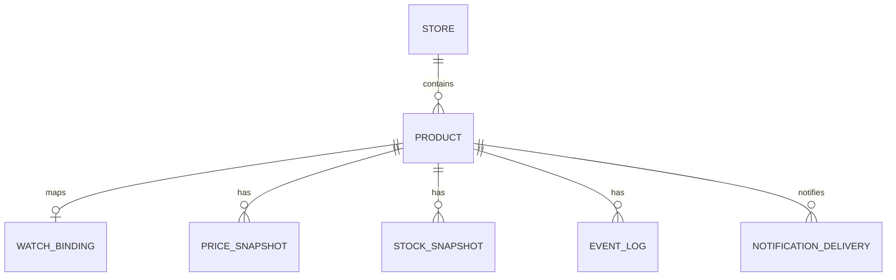

# Veritabanı Taslağı

## User

Firebase Auth kullanıcısının yerel izdüşümü. Ayrı bir kayıt ucu yoktur; hesap Firebase'de
açılır, ilk kimliği doğrulanmış istekte bu satır oluşur.

- id UUID
- firebaseUid varchar(128) unique
- email varchar(320) nullable
- emailVerified boolean
- displayName varchar(200) nullable
- signInProvider varchar(50) nullable (`password`, `apple.com`, `google.com`)
- telegramChatId varchar(64) nullable
- onboardingCompletedAt timestamp nullable
- lastSeenAt timestamp nullable
- createdAt
- updatedAt

`email` unique **değildir**: Firebase'de aynı e-posta farklı sağlayıcılarla ayrı UID alabilir.
Tekillik `firebaseUid` üzerindedir.

## Store

- id UUID
- hostname varchar unique
- name varchar
- profileKey varchar default `generic`
- profileVersion integer
- profileStatus enum (`GENERIC`, `VERIFIED`, `DISABLED`)
- active boolean
- createdAt
- updatedAt

## Product

- id UUID
- userId UUID (`User`, on delete cascade)
- storeId UUID
- watchId UUID nullable (`Watch`, on delete set null)
- name varchar nullable
- url text
- normalizedUrl text
- imageUrl text nullable
- currentPrice decimal nullable
- previousPrice decimal nullable
- currency varchar(3) nullable
- targetPrice decimal nullable
- inStock boolean nullable
- notificationsEnabled boolean
- status enum
- lastCheckedAt timestamp nullable
- lastSuccessfulCheckAt timestamp nullable
- lastErrorCode varchar nullable
- lastErrorMessage text nullable
- createdAt
- updatedAt

Unique:

```text
(userId, storeId, normalizedUrl)
```

Aynı URL'yi birden çok kullanıcı takip edebilir; tekillik kullanıcı içindedir.

Index:

```text
(userId, createdAt desc)
(watchId)
```

Her public hostname ilk ürün eklenirken `GENERIC` store olarak oluşturulabilir. Sonradan doğrulanmış bir site profile eklendiğinde aynı Store kaydı `profileKey/profileVersion` ile güncellenir.

## Watch

Watch ürünün değil URL'nin varlığıdır: aynı normalize URL'yi izleyen tüm kullanıcıların
ürünleri tek watch'a bağlanır (`Watch` 1:N `Product`) ve gelen gözlem hepsine fan-out edilir.
Gerekçe: `docs/ADR/ADR-0005-firebase-auth-and-multi-tenancy.md`.

- id UUID
- storeId UUID
- normalizedUrl text
- externalWatchId varchar unique
- requestedFetchMode enum (`AUTO`, `HTTP`, `BROWSER`)
- fetchMode enum (`HTTP`, `BROWSER`)
- lastSyncAt timestamp nullable (baseline senkronunun tükettiği son sonuç)
- lastTriggeredAt timestamp nullable (manuel kontrol soğuma penceresi)
- paused boolean
- createdAt
- updatedAt

Unique:

```text
(storeId, normalizedUrl)
```

`lastSyncAt` ve `lastTriggeredAt` ayrıdır: biri "bu sonucu işledim", diğeri "az önce kontrol
tetikledim" anlamına gelir ve paylaşılan watch'ta ikisi birbirini bastırmamalıdır.

`requestedFetchMode=AUTO` ilk olarak `fetchMode=HTTP` oluşturur. Baseline fiyat çıkaramazsa yalnız bir kez `BROWSER` moduna yükseltilir; kalıcı mod restart sonrasında tekrar denenmez.

## PriceSnapshot

- id UUID
- productId UUID
- price decimal
- currency varchar(3)
- observedAt timestamp
- sourceEventKey varchar

Unique:

```text
(productId, sourceEventKey)
```

Tek webhook N ürüne yazıldığı için `sourceEventKey` global değil ürün başına tekildir.

Index:

```text
(productId, observedAt desc)
```

## StockSnapshot

- id UUID
- productId UUID
- inStock boolean
- availableSizes jsonb nullable
- observedAt timestamp
- sourceEventKey varchar (unique: `(productId, sourceEventKey)`)

## EventLog

Yalnız önemli durum ve hatalar:

- id UUID
- productId UUID nullable
- type varchar
- code varchar nullable
- message text
- metadata jsonb nullable
- createdAt

## AppSetting

- key varchar primary key
- value jsonb
- updatedAt

MVP anahtarları:

```text
checks.defaultIntervalSeconds = 86400
reconciliation.lastCompletedAt
```

Onboarding artık burada değil `User.onboardingCompletedAt` alanındadır: kurulum durumu
sunucu geneli değil kullanıcı başınadır.

`reconciliation.lastCompletedAt` değeri günlük cron'un son tur özetidir:
`{ completedAt, checked, missing, orphaned, drifted, watchErrors }`.

EventLog `type` sözlüğü: `EXTRACTION_ERROR`, `CURRENCY_CHANGED`, `RECONCILIATION`,
`ORPHANED_WATCH`.
`RECONCILIATION` satırlarının `code` değerleri `docs/ARCHITECTURE.md` §10 içindedir.

Secret değerler `AppSetting` içinde tutulmaz.

## NotificationDelivery

- id UUID
- productId UUID
- sourceEventKey varchar
- channel enum (`TELEGRAM`)
- type enum (`PRICE_CHANGED`, `TARGET_REACHED`, `RESTOCKED`, `WATCH_ERROR`)
- status enum (`PENDING`, `PROCESSING`, `SENT`, `FAILED`)
- payload jsonb
- attempts integer default 0
- nextAttemptAt timestamp nullable
- lockedAt timestamp nullable
- sentAt timestamp nullable
- lastErrorCode varchar nullable
- lastErrorMessage text nullable
- createdAt
- updatedAt

Unique:

```text
(productId, sourceEventKey, channel, type)
```

Index:

```text
(status, nextAttemptAt)
```

Outbox worker `PENDING` veya zamanı gelmiş `FAILED` kayıtlarını atomik olarak `PROCESSING` durumuna alır. Süresi geçmiş lock'lar restart sonrası tekrar kuyruğa alınır. Maksimum 5 deneme ve artan gecikme uygulanır.

## ER


