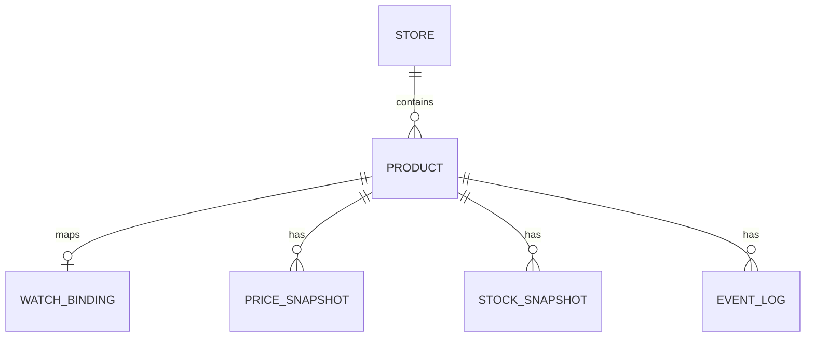

# Veritabanı Taslağı

## Store

- id UUID
- code varchar unique
- name varchar
- hostnames jsonb
- active boolean
- createdAt
- updatedAt

## Product

- id UUID
- storeId UUID
- name varchar nullable
- url text
- normalizedUrl text
- imageUrl text nullable
- currentPrice decimal nullable
- previousPrice decimal nullable
- currency varchar(3) nullable
- targetPrice decimal nullable
- inStock boolean nullable
- notificationsEnabled boolean
- status enum
- lastCheckedAt timestamp nullable
- lastSuccessfulCheckAt timestamp nullable
- lastErrorCode varchar nullable
- lastErrorMessage text nullable
- createdAt
- updatedAt

Unique:

```text
(storeId, normalizedUrl)
```

## WatchBinding

- id UUID
- productId UUID
- externalWatchId varchar unique
- fetchMode enum
- lastSyncAt timestamp nullable
- createdAt
- updatedAt

Başlangıçta Product 1:1 WatchBinding. Beden spike sonucu 1:N gerekirse ADR ile değiştirilir.

## PriceSnapshot

- id UUID
- productId UUID
- price decimal
- currency varchar(3)
- observedAt timestamp
- sourceEventKey varchar unique

Index:

```text
(productId, observedAt desc)
```

## StockSnapshot

- id UUID
- productId UUID
- inStock boolean
- availableSizes jsonb nullable
- observedAt timestamp
- sourceEventKey varchar unique

## EventLog

Yalnız önemli durum ve hatalar:

- id UUID
- productId UUID nullable
- type varchar
- code varchar nullable
- message text
- metadata jsonb nullable
- createdAt

## AppSetting

- key varchar primary key
- value jsonb
- updatedAt

## ER


