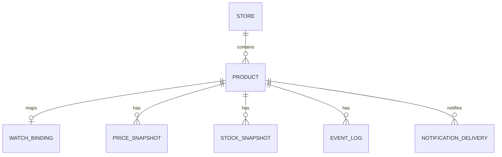

# Veritabanı Taslağı

## Store

- id UUID
- hostname varchar unique
- name varchar
- profileKey varchar default `generic`
- profileVersion integer
- profileStatus enum (`GENERIC`, `VERIFIED`, `DISABLED`)
- active boolean
- createdAt
- updatedAt

## Product

- id UUID
- storeId UUID
- name varchar nullable
- url text
- normalizedUrl text
- imageUrl text nullable
- currentPrice decimal nullable
- previousPrice decimal nullable
- currency varchar(3) nullable
- targetPrice decimal nullable
- inStock boolean nullable
- notificationsEnabled boolean
- status enum
- lastCheckedAt timestamp nullable
- lastSuccessfulCheckAt timestamp nullable
- lastErrorCode varchar nullable
- lastErrorMessage text nullable
- createdAt
- updatedAt

Unique:

```text
(storeId, normalizedUrl)
```

Her public hostname ilk ürün eklenirken `GENERIC` store olarak oluşturulabilir. Sonradan doğrulanmış bir site profile eklendiğinde aynı Store kaydı `profileKey/profileVersion` ile güncellenir.

## WatchBinding

- id UUID
- productId UUID
- externalWatchId varchar unique
- requestedFetchMode enum (`AUTO`, `HTTP`, `BROWSER`)
- fetchMode enum (`HTTP`, `BROWSER`)
- lastSyncAt timestamp nullable
- createdAt
- updatedAt

Başlangıçta Product 1:1 WatchBinding. Beden spike sonucu 1:N gerekirse ADR ile değiştirilir.

`requestedFetchMode=AUTO` ilk olarak `fetchMode=HTTP` oluşturur. Baseline fiyat çıkaramazsa yalnız bir kez `BROWSER` moduna yükseltilir; kalıcı mod restart sonrasında tekrar denenmez.

## PriceSnapshot

- id UUID
- productId UUID
- price decimal
- currency varchar(3)
- observedAt timestamp
- sourceEventKey varchar unique

Index:

```text
(productId, observedAt desc)
```

## StockSnapshot

- id UUID
- productId UUID
- inStock boolean
- availableSizes jsonb nullable
- observedAt timestamp
- sourceEventKey varchar unique

## EventLog

Yalnız önemli durum ve hatalar:

- id UUID
- productId UUID nullable
- type varchar
- code varchar nullable
- message text
- metadata jsonb nullable
- createdAt

## AppSetting

- key varchar primary key
- value jsonb
- updatedAt

MVP anahtarları:

```text
onboarding.completedAt
checks.defaultIntervalSeconds = 86400
reconciliation.lastCompletedAt
```

Secret değerler `AppSetting` içinde tutulmaz.

## NotificationDelivery

- id UUID
- productId UUID
- sourceEventKey varchar
- channel enum (`TELEGRAM`)
- type enum (`PRICE_CHANGED`, `TARGET_REACHED`, `RESTOCKED`, `WATCH_ERROR`)
- status enum (`PENDING`, `PROCESSING`, `SENT`, `FAILED`)
- payload jsonb
- attempts integer default 0
- nextAttemptAt timestamp nullable
- lockedAt timestamp nullable
- sentAt timestamp nullable
- lastErrorCode varchar nullable
- lastErrorMessage text nullable
- createdAt
- updatedAt

Unique:

```text
(sourceEventKey, channel, type)
```

Index:

```text
(status, nextAttemptAt)
```

Outbox worker `PENDING` veya zamanı gelmiş `FAILED` kayıtlarını atomik olarak `PROCESSING` durumuna alır. Süresi geçmiş lock'lar restart sonrası tekrar kuyruğa alınır. Maksimum 5 deneme ve artan gecikme uygulanır.

## ER


